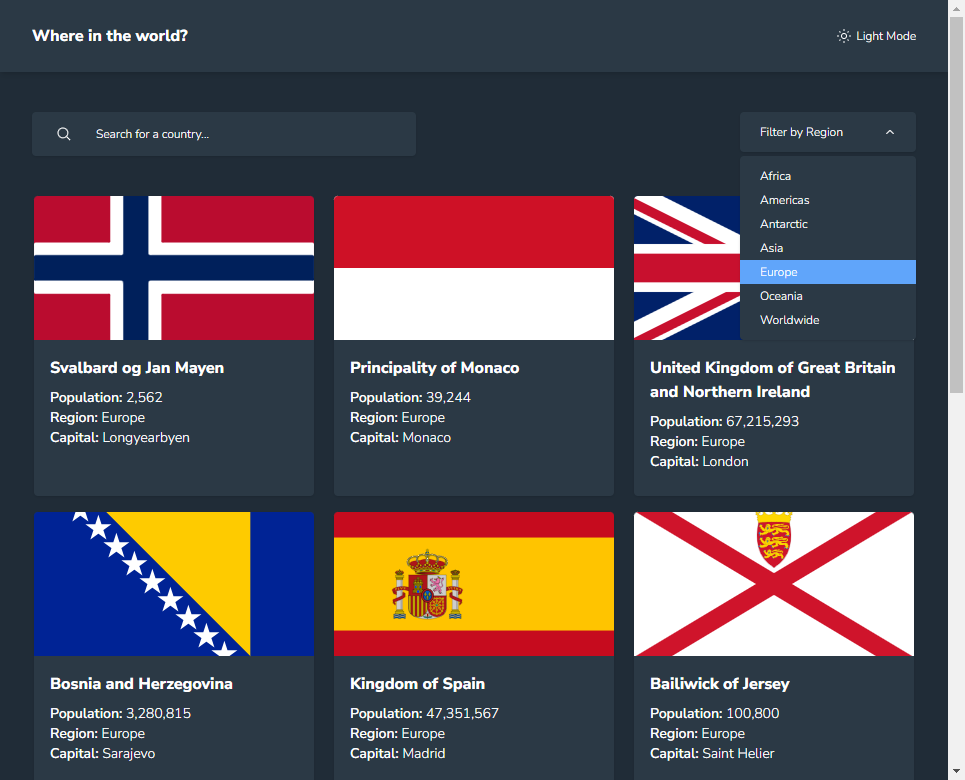

# Frontend Mentor - REST Countries API with color theme switcher solution

This is a solution to the [REST Countries API with color theme switcher challenge on Frontend Mentor](https://www.frontendmentor.io/challenges/rest-countries-api-with-color-theme-switcher-5cacc469fec04111f7b848ca). Frontend Mentor challenges help you improve your coding skills by building realistic projects. 

## Table of contents

- [Frontend Mentor - REST Countries API with color theme switcher solution](#frontend-mentor---rest-countries-api-with-color-theme-switcher-solution)
  - [Table of contents](#table-of-contents)
  - [Overview](#overview)
    - [Screenshot](#screenshot)
    - [Links](#links)
  - [My process](#my-process)
    - [Built with](#built-with)
    - [Useful resources](#useful-resources)
  - [Author](#author)

## Overview

Users are able to:

- See all countries from the API on the homepage
- Search for a country using an `input` field
- Filter countries by region
- Click on a country to see more detailed information on a separate page
- Click through to the border countries on the detail page
- Toggle the color scheme between light and dark mode 

### Screenshot

### Links

- Solution URL: [GitHub repo](### Links

- Solution URL: [GitHub repo](https://github.com/nicknjagi/rest-countries-api-with-color-theme-switcher)
- Live Site URL: [Demo 🔗](https://spectacular-rugelach-ae2138.netlify.app/)

## My process

### Built with

- Semantic HTML5 markup
- TailwindCSS
- React
- REST countries API
- Flexbox
- Mobile-first workflow

### Useful resources

- [Resource 1.](https://zellwk.com/blog/how-to-write-mobile-first-css/) - An article on how to write mobile-first CSS
- [Resource 2.](https://www.internetingishard.com/html-and-css/flexbox/) - This Flexbox tutorial is a friendly tutorial for modern CSS layouts by [Interneting Is Hard](https://www.internetingishard.com/).

## Author

- Frontend Mentor - [@nicknjagi](https://www.frontendmentor.io/profile/nicknjagi)
- Twitter - [@nick_njagi](https://www.twitter.com/nick_njagi)

- Website - [nicholasnjagi.netlify.app](https://nicholasnjagi.netlify.app/)

